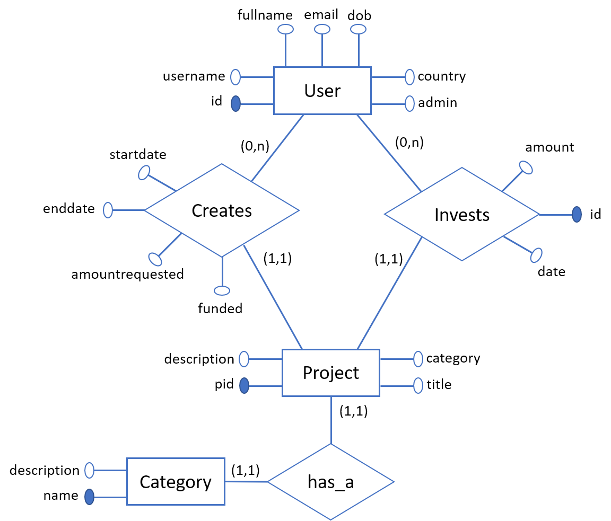
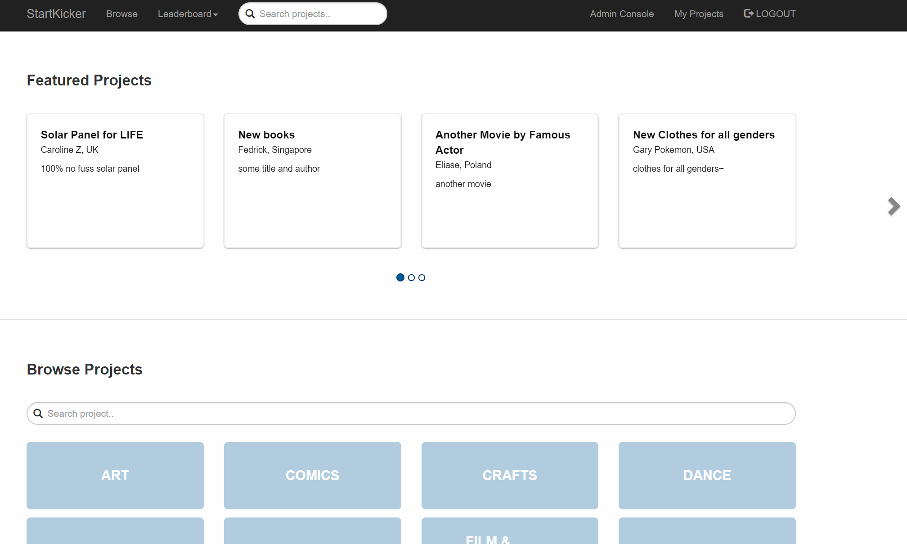
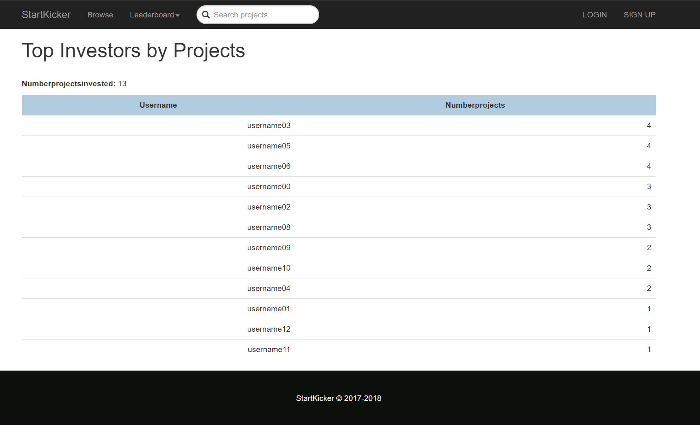
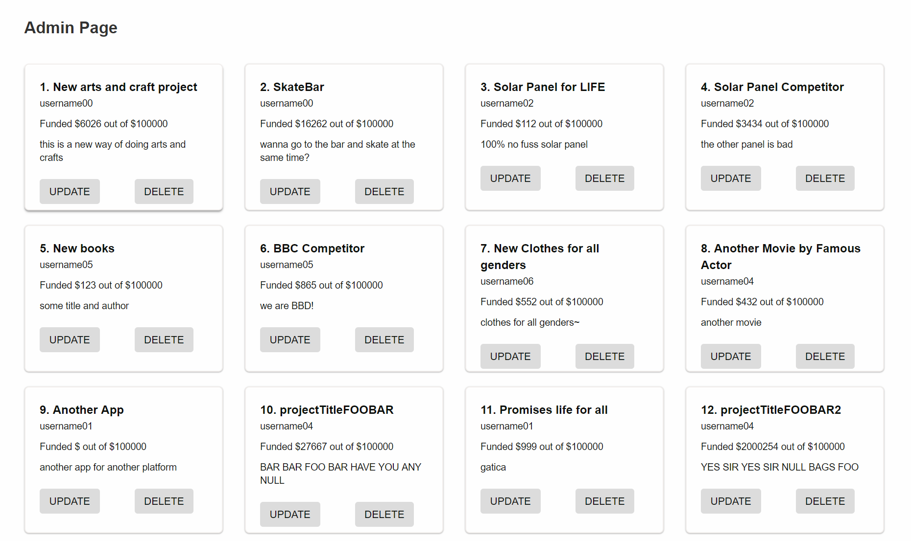
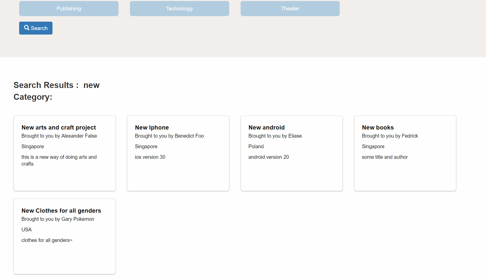

## CS2102 Group 42

Phua Han Siang A0125634J


Web Server: NodeJS with Express

Sever Language: Javascript

Database: PostgreSQL


Special thanks to Peter Kristianto Widjaja, https://github.com/peterkwidjaja, 

who offered support and guidance in the creation of the front end of the application

# Database Schema

This project is created under the following problem scope:
```
Topic B, Crowdfunding: the system is a catalogue of projects looking for crowdfunding.
Entrepreneurs can advertise their projects (title, description, start date, duration, keywords or
categories, amount of funding sought). Users can browse the projects and fund projects. Users can
play both roles of entrepreneurs and investors. The system tracks the current amount of funding
raised, brings the project to the status of “funded” and advertises this success on a page of funded
project. Each user has an account. Administrators can create, modify and delete all entries. Please
refer to www.globalgiving.org, fundanything.com or other crowdfunding sites for examples and
data.
```

## ER Diagram



## SQL Commands for the schema

```
DROP FUNCTION projectInvestment(INT);
DROP TABLE investment;
DROP TABLE project;
DROP TABLE category;
DROP TABLE users;

```


UserAccounts table

```
CREATE TABLE users (
    id SERIAL PRIMARY KEY,
	username VARCHAR(32) UNIQUE NOT NULL,
	fullname VARCHAR(64) NOT NULL,
	email VARCHAR(256),
	dob DATE,
	country VARCHAR(64),
	admin BOOLEAN
	);
```

Catagories table

```
CREATE TABLE category (
	name VARCHAR(64) PRIMARY KEY,
    description VARCHAR(1024)
	);
```

Projects table

```
CREATE TABLE project (
	pid SERIAL PRIMARY KEY,
	creator INTEGER REFERENCES users(id) ON DELETE SET NULL,
	title VARCHAR(256),
	description VARCHAR(256),
	category VARCHAR(64) REFERENCES category(name),
	startdate DATE NOT NULL,
	enddate DATE NOT NULL,
	amountrequested INT CHECK(amountrequested > 0),
    funded BOOLEAN
	);
```

Investment table

```
CREATE TABLE investment (
    id SERIAL PRIMARY KEY,
    investor VARCHAR(32) REFERENCES users(username) ON DELETE SET NULL,
    project INT REFERENCES project(pid) ON DELETE SET NULL,
    amount DECIMAL CHECK(amount > 0),
    date DATE
);

```

Project Funding function

```
CREATE OR REPLACE FUNCTION projectInvestment(projectid INT)
    RETURNS DECIMAL AS $$
    DECLARE totalinvestment DECIMAL;
    BEGIN
    SELECT SUM(i.amount) INTO totalinvestment
    FROM investment i, project p
    WHERE projectid = p.pid
    AND i.project = p.pid;
    RETURN totalinvestment;
    END; $$
    LANGUAGE PLPGSQL;
```

addInvestmentTrigger function

```
CREATE OR REPLACE FUNCTION addInvestmentTrigger()
    RETURNS trigger AS
    $$
    BEGIN
    UPDATE project
    SET funded = CASE WHEN (projectInvestment(pid) >= amountrequested) THEN true
    WHEN (projectInvestment(pid) < amountrequested) THEN false
    END
    WHERE project.pid = NEW.project;
    RETURN NULL;
    END;
    $$
    LANGUAGE 'plpgsql';

```

Trigger to update funded column in project

```
CREATE TRIGGER check_funded
    AFTER INSERT OR UPDATE ON investment
    FOR EACH ROW
    EXECUTE PROCEDURE addInvestmentTrigger();
```

updateProjectTrigger function

```
CREATE OR REPLACE FUNCTION updateProjectTrigger()
    RETURNS trigger AS
    $$
    BEGIN
        UPDATE project
        SET funded = CASE
            WHEN (projectInvestment(pid) >= amountrequested) THEN true
            WHEN (projectInvestment(pid) < amountrequested) THEN false
            END
        WHERE project.pid = NEW.pid;
    RETURN NULL;
    END;
    $$
LANGUAGE 'plpgsql';

```

Trigger to update funded column in project

```
CREATE TRIGGER check_funded2
    AFTER UPDATE OF amountrequested ON project
    FOR EACH ROW
    EXECUTE PROCEDURE updateProjectTrigger();

```


## Key SQL commands used in database

GET_FEATURED_PROJECTS

```
SELECT pr.pid, pr.creator, pr.title, pr.description,
to_char(pr.startdate, \'DD-MM-YYYY\'),
to_char(pr.enddate, \'DD-MM-YYYY\'), pr.amountrequested, 
((SELECT SUM(investment.amount) FROM investment WHERE investment.project = pr.pid) / pr.amountrequested) 
    AS percentage, 
u.username, u.fullname, u.country
FROM project pr, users u 
WHERE pr.creator = u.id 
ORDER BY percentage ASC
LIMIT 12;
```


GET_ALL_PROJECTS

```
SELECT pr.pid, pr.creator, pr.title, pr.description,
to_char(pr.startdate, \'DD-MM-YYYY\'),
to_char(pr.enddate, \'DD-MM-YYYY\'), pr.amountrequested, 
u.username, u.fullname, u.country
FROM project pr, users u 
WHERE pr.creator = u.id 
AND UPPER(pr.title) LIKE UPPER($1)
ORDER BY pr.title;
```

GET_PROJECTS

```
SELECT pr.pid, pr.title, pr.description, pr.owner_account,
    usr.fullname as owner, usr.country as owner_country 
FROM project pr
INNER JOIN users usr ON usr.id=pr.owner_account
WHERE UPPER(pr.title) LIKE UPPER($1)
ORDER BY pr.title;
```


GET_PROJECT_BY_ID

```
SELECT pr.pid, pr.title, pr.description, pr.creator, pr.category, 
pr.startdate, pr.enddate, pr.amountrequested, pr.funded, 
DATE_PART(\'day\', pr.enddate::timestamp - pr.startdate::timestamp) as daysleft, 
(SELECT SUM(investment.amount) FROM investment WHERE investment.project = pr.pid)
    AS amountfunded, 
users.fullname AS owner, users.country AS ownercountry, users.username AS ownerusername 
FROM project pr INNER JOIN users ON pr.creator = users.id WHERE pr.pid = $1;
```

GET_INVEST_AMOUNT_LEADERBOARD

```

SELECT u.username, SUM(i.amount) AS totalinvestment
FROM users u, investment i
WHERE i.investor = u.username
GROUP BY u.username
ORDER BY totalinvestment DESC;
```

## Populating of database

Use the following commands to populate the table with test values

```
$ npm run droptables && npm run maketables && npm run populate
```

## Example data to populate database

As the project uses the PG module in Node.JS, the following SQL queries are written in JS string formats.

These files can be found under ../populate in this Repo


populateUser.js

```
INSERT INTO users VALUES(DEFAULT, 'username00', 'Alexander False', 
    'Alexander@email.com', '1999-01-12', 'Singapore', false);
INSERT INTO users VALUES(DEFAULT, 'username01', 'Benedict Foo', 
    'Benedict@email.com', '2001-12-14', 'Singapore', false);
INSERT INTO users VALUES(DEFAULT, 'username02', 'Caroline Z', 
    'Caroline@email.com', '1994-03-01', 'UK', false);
INSERT INTO users VALUES(DEFAULT, 'username03', 'Denmarkian', 
    'Denmarkian@email.com', '1999-04-25', 'Denmark', false);
INSERT INTO users VALUES(DEFAULT, 'username04', 'Eliase', 
    'Eliase@email.com', '1999-06-22', 'Poland', false);
INSERT INTO users VALUES(DEFAULT, 'username05', 'Fedrick', 
    'Fedrick@email.com', '1996-04-17', 'Singapore', false);
INSERT INTO users VALUES(DEFAULT, 'username06', 'Gary Pokemon', 
    'Gary@email.com', '1996-02-18', 'USA', false);
INSERT INTO users VALUES(DEFAULT, 'username07', 'Henry Chia', 
    'Henry@email.com', '1997-07-01', 'Singapore', false);
INSERT INTO users VALUES(DEFAULT, 'username08', 'Idra', 
    'Idra@email.com', '1992-08-02', 'Singapore', false);
INSERT INTO users VALUES(DEFAULT, 'username09', 'Jackonston', 
    'Jackonston@email.com', '1994-11-04', 'Singapore', false);
INSERT INTO users VALUES(DEFAULT, 'username10', 'Kelly', 
    'Kelly@email.com', '1994-11-05', 'UK', false);
INSERT INTO users VALUES(DEFAULT, 'username11', 'Louis', 
    'Louis@email.com', '1993-01-09', 'UK', false);
INSERT INTO users VALUES(DEFAULT, 'username12', 'Mandy Foo', 
    'Mandy@email.com', '1999-01-06', 'US', false);
INSERT INTO users VALUES(DEFAULT, 'username13', 'full name', 
    'email@email.com', '1999-01-08', 'Thailand', false);
INSERT INTO users VALUES(DEFAULT, 'username14', 'full name', 
    'email@email.com', '1999-01-14', 'South Korea', false);
INSERT INTO users VALUES(DEFAULT, 'username15', 'full name', 
    'email@email.com', '1999-01-23', 'Singapore', false);
INSERT INTO users VALUES(DEFAULT, 'username16', 'full name', 
    'email@email.com', '1999-01-28', 'Singapore', false);
INSERT INTO users VALUES(DEFAULT, 'username17', 'full name', 
    'email@email.com', '1999-12-31', 'UK', false);
INSERT INTO users VALUES(DEFAULT, 'username18', 'full name', 
    'email@email.com', '1999-01-01', 'Malaysia', false);
INSERT INTO users VALUES(DEFAULT, 'username19', 'full name', 
    'email@email.com', '1999-01-01', 'Japan', false);
INSERT INTO users VALUES(DEFAULT, 'username20', 'full name', 
    'email@email.com', '1999-01-01', 'France', false);
INSERT INTO users VALUES(DEFAULT, 'username21', 'full name', 
    'email@email.com', '1999-01-01', 'Russia', false);
INSERT INTO users VALUES(DEFAULT, 'admin01', 'full name', 
    'email@email.com', '1999-01-01', 'Japan', true);

```


populateCat.js

```

INSERT INTO category VALUES('Art');
INSERT INTO category VALUES('Comics');
INSERT INTO category VALUES('Crafts');
INSERT INTO category VALUES('Dance');
INSERT INTO category VALUES('Design');
INSERT INTO category VALUES('Fashion');
INSERT INTO category VALUES('Film & Video');
INSERT INTO category VALUES('Food');
INSERT INTO category VALUES('Games');
INSERT INTO category VALUES('Journalism');
INSERT INTO category VALUES('Music');
INSERT INTO category VALUES('Photography');
INSERT INTO category VALUES('Publishing');
INSERT INTO category VALUES('Technology');
INSERT INTO category VALUES('Theater');


```


populateProject.js

```
INSERT INTO project VALUES(DEFAULT, 1, 'New arts and craft project', 
    'this is a new way of doing arts and crafts', 'Art', '1999-01-01', '2018-01-01', 100000, FALSE);
INSERT INTO project VALUES(DEFAULT, 1, 'SkateBar', 
    'wanna go to the bar and skate at the same time?', 'Games', '1999-01-01', '2018-01-01', 100000, FALSE);
INSERT INTO project VALUES(DEFAULT, 3, 'Solar Panel for LIFE', 
    '100% no fuss solar panel', 'Games', '1999-01-01', '2019-01-01', 100000, FALSE);
INSERT INTO project VALUES(DEFAULT, 3, 'Solar Panel Competitor', 
    'the other panel is bad', 'Games', '1999-01-01', '2020-01-01', 100000, FALSE);
INSERT INTO project VALUES(DEFAULT, 6, 'New books', 
    'some title and author', 'Comics', '1999-01-01', '2019-01-01', 100000, FALSE);
INSERT INTO project VALUES(DEFAULT, 6, 'BBC Competitor', 
    'we are BBD!', 'Journalism', '1999-01-01', '2018-04-01', 100000, FALSE);
INSERT INTO project VALUES(DEFAULT, 7, 'New Clothes for all genders', 
    'clothes for all genders~', 'Fashion', '1999-01-06', '2018-01-01', 100000, FALSE);
INSERT INTO project VALUES(DEFAULT, 5, 'Another Movie by Famous Actor', 
    'another movie', 'Film & Video', '1999-01-01', '2017-09-01', 100000, FALSE);
INSERT INTO project VALUES(DEFAULT, 2, 'Another App', 
    'another app for another platform', 'Technology', '1999-01-01', '2018-11-01', 100000, FALSE);
INSERT INTO project VALUES(DEFAULT, 5, 'projectTitleFOOBAR', 
    'BAR BAR FOO BAR HAVE YOU ANY NULL', 'Dance', '1999-01-01', '2020-01-01', 100000, FALSE);
INSERT INTO project VALUES(DEFAULT, 2, 'Promises life for all', 
    'gatica', 'Journalism', '1999-01-01', '2020-01-01', 100000, FALSE);
INSERT INTO project VALUES(DEFAULT, 5, 'projectTitleFOOBAR2', 
    'YES SIR YES SIR NULL BAGS FOO', 'Technology', '1999-01-01', '2020-01-01', 100000, FALSE);
INSERT INTO project VALUES(DEFAULT, 8, 'Pottery', 
    'pots and pans', 'Crafts', '1999-01-01', '2020-01-01', 100000, FALSE);
INSERT INTO project VALUES(DEFAULT, 5, 'New android', 
    'android version 20', 'Technology', '1999-01-01', '2020-01-01', 100000, FALSE);
INSERT INTO project VALUES(DEFAULT, 5, 'Sick RnB', 
    'some form of music', 'Music', '1999-01-01', '2020-01-01', 100000, FALSE);
INSERT INTO project VALUES(DEFAULT, 2, 'New Iphone', 
    'ios version 30', 'Technology', '1999-01-01', '2020-01-01', 100000, FALSE);
    

```


populateInvest.js

```
INSERT INTO investment VALUES(DEFAULT , 'username02', '4', 3434 , '2016-01-01');
INSERT INTO investment VALUES(DEFAULT , 'username05', '3', 100 , '2017-05-03');
INSERT INTO investment VALUES(DEFAULT , 'username00', '7', 24 , '2016-01-01');
INSERT INTO investment VALUES(DEFAULT , 'username00', '2', 7655 , '2017-01-01');
INSERT INTO investment VALUES(DEFAULT , 'username03', '5', 11 , '2017-01-01');
INSERT INTO investment VALUES(DEFAULT , 'username05', '8', 432 , '2016-04-01');
INSERT INTO investment VALUES(DEFAULT , 'username00', '12', 256 , '2016-01-01');
INSERT INTO investment VALUES(DEFAULT , 'username08', '16', 3333 , '2017-09-01');
INSERT INTO investment VALUES(DEFAULT , 'username09', '10', 333 , '2017-11-01');
INSERT INTO investment VALUES(DEFAULT , 'username04', '2', 5353 , '2017-01-01');
INSERT INTO investment VALUES(DEFAULT , 'username08', '1', 2558 , '2016-04-01');
INSERT INTO investment VALUES(DEFAULT , 'username05', '1', 3456 , '2016-03-01');
INSERT INTO investment VALUES(DEFAULT , 'username12', '2', 3242 , '2015-05-01');
INSERT INTO investment VALUES(DEFAULT , 'username10', '11', 999 , '2017-05-12');
INSERT INTO investment VALUES(DEFAULT , 'username11', '10', 453 , '2017-05-01');
INSERT INTO investment VALUES(DEFAULT , 'username02', '10', 23425 , '2015-10-01');
INSERT INTO investment VALUES(DEFAULT , 'username05', '12', 999999 , '2014-11-01');
INSERT INTO investment VALUES(DEFAULT , 'username03', '13', 9999 , '2010-09-13');
INSERT INTO investment VALUES(DEFAULT , 'username08', '13', 3456 , '2010-09-14');
INSERT INTO investment VALUES(DEFAULT , 'username06', '12', 999999 , '2012-05-21');
INSERT INTO investment VALUES(DEFAULT , 'username01', '16', 3456 , '2012-06-22');
INSERT INTO investment VALUES(DEFAULT , 'username10', '10', 3456 , '2011-05-12');
INSERT INTO investment VALUES(DEFAULT , 'username09', '5', 112 , '2015-07-01');
INSERT INTO investment VALUES(DEFAULT , 'username03', '6', 643 , '2015-07-01');
INSERT INTO investment VALUES(DEFAULT , 'username03', '7', 453 , '2017-05-01');
INSERT INTO investment VALUES(DEFAULT , 'username02', '7', 75 , '2017-05-12');
INSERT INTO investment VALUES(DEFAULT , 'username04', '6', 222 , '2016-03-21');
INSERT INTO investment VALUES(DEFAULT , 'username06', '3', 12 , '2012-03-21');
INSERT INTO investment VALUES(DEFAULT , 'username06', '2', 12 , '2011-05-21');
INSERT INTO investment VALUES(DEFAULT , 'username06', '1', 12 , '2012-05-21');

```


## Screenshots

### Home screen




### Leaderboard screen




### Admin console




### Search page


