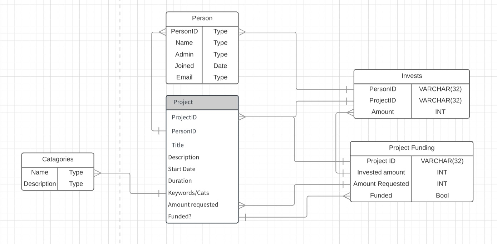

# Database Schema

This project is created under the following problem scope:
```
Topic B, Crowdfunding: the system is a catalogue of projects looking for crowdfunding.
Entrepreneurs can advertise their projects (title, description, start date, duration, keywords or
categories, amount of funding sought). Users can browse the projects and fund projects. Users can
play both roles of entrepreneurs and investors. The system tracks the current amount of funding
raised, brings the project to the status of “funded” and advertises this success on a page of funded
project. Each user has an account. Administrators can create, modify and delete all entries. Please
refer to www.globalgiving.org, fundanything.com or other crowdfunding sites for examples and
data.
```

## ER Diagram



## SQL Commands for the schema

UserAccounts table

```
CREATE TABLE users (
	uid INT PRIMARY KEY,
	username VARCHAR(32),
	fullname VARCHAR(64),
	email VARCHAR(256),
	dob DATE,
	country VARCHAR(64),
	role VARCHAR(8)
	);
```

Catagories table

```
CREATE TABLE catagory (
	catagory PRIMARY KEY
	);
```

Projects table

```
CREATE TABLE project (
	pid INT PRIMARY KEY,
	creator REFERENCES account(uid),
	title,
	description,
	catagory REFERENCES catagory(name),
	startdate DATE,
	enddate DATE,
	amountrequested
	);
```

Investment table

```
CREATE TABLE invest (
	investor INT REFERENCES account(uid),
	project INT REFERENCES project(pid),
	amount
	);
```

Project Funding view

```
CREATE VIEW funding AS
	SELECT
	FROM
	;
```

## Populating of database

Use the following commands to populate the table with test values

```
Give the example
```

And

```
until finished
```
